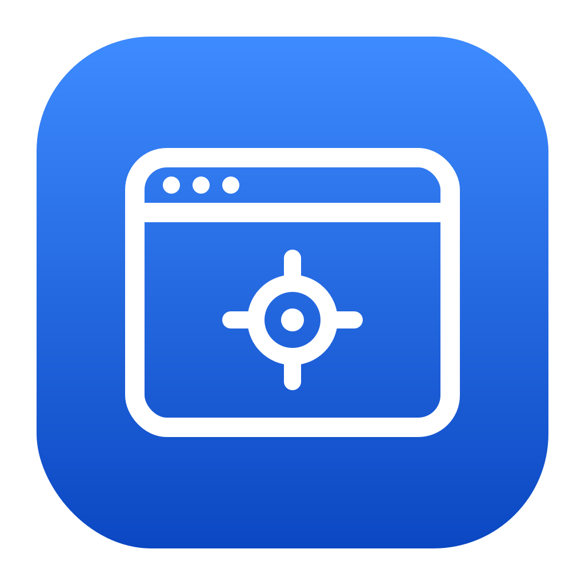

<h1 align="center">
  
</h1>

<p align="center">
  <a href="https://github.com/fefedimoraes/centerd/releases/latest">
    
  </a>
  
  
</p>

# centerd

`centerd` is a macOS background agent that lets you bind keyboard shortcuts to specific
applications, so you can jump straight to the app you want instead of cycling through
everything with <kbd>⌘</kbd> + <kbd>Tab</kbd>.

Press a binding and `centerd`:

- **Switches to the app** if it is running with a single window — and centers the mouse
  cursor in that window (hence the name), so you are immediately ready to use it.
- **Shows a window switcher** if the app has multiple windows: an Alt-Tab-style vertical
  list of window titles. Hold the modifiers and tap the main key to cycle the selection;
  release the modifiers to commit.
- **Launches the app** if it is not running (when `launch-application` is enabled).

## The window switcher

When a bound app has more than one window, a floating panel appears with the app's icon
and name as a header, followed by its window titles in a vertical list:

| <App icon> Google Chrome |
| ------------------------ |
| YouTube – Home           |
| Gmail – Inbox            |
| Google Sheets            |

The currently selected window is highlighted in the system accent color. The default
selection mirrors <kbd>⌘</kbd> + <kbd>Tab</kbd>: the second window when the app is already
frontmost, otherwise the first. Each tap of the main key moves the highlight down and
wraps around at the bottom. Releasing the modifier keys raises the highlighted window and
(optionally) centers the mouse on it.

## Configuration

`centerd` reads its configuration from `~/.config/centerd/config.json`. With
`hot-reload-config` enabled, the file is watched and changes apply automatically — no
restart needed.

```json
{
  "options": {
    "center-mouse-cursor": true,
    "launch-application": true,
    "hot-reload-config": true
  },
  "applications": {
    "Google Chrome": {
      "bundle-id": "com.google.Chrome",
      "shortcut": ["control", "shift", "b"]
    }
  }
}
```

### Options

| Option                | Description                                                        |
| --------------------- | ------------------------------------------------------------------ |
| `center-mouse-cursor` | Center the mouse cursor in the destination window after switching. |
| `launch-application`  | Launch a bound application that is not currently running.          |
| `hot-reload-config`   | Watch the config file and reload it automatically when it changes. |

### Applications

Each entry under `applications` is keyed by the app's display name and accepts:

| Key         | Required | Description                                                                                                       |
| ----------- | -------- | ----------------------------------------------------------------------------------------------------------------- |
| `bundle-id` | Yes      | The application's bundle identifier (e.g. `com.google.Chrome`). Used for precise targeting.                       |
| `shortcut`  | Yes      | The shortcut tokens. All but the last are modifiers; the last is the main key — e.g. `["control", "shift", "b"]`. |

Supported modifier tokens: `control` (`ctrl`), `shift`, `command` (`cmd`),
`option` (`opt`, `alt`). The main key is matched against the character your keyboard
produces, so bindings work across keyboard layouts.

## Permissions

`centerd` requires **Accessibility** permission to read window titles, raise windows, and
move the mouse, and **Input Monitoring** to listen for the global shortcuts. On first
launch you will be prompted; grant access in
**System Settings → Privacy & Security → Accessibility** (and **Input Monitoring**).
Without these permissions the agent cannot function.

## Running

`centerd` runs as a background agent (`LSUIElement`): it has no Dock icon and no main
window. It lives in the menu bar, where a status item provides:

- **Reload Config** — re-read the configuration file on demand.
- **Quit centerd** — exit the agent.

## Building

Open the project in Xcode and build/run the `centerd` scheme, or from the command line:

```sh
xcodebuild -project centerd.xcodeproj -scheme centerd -configuration Debug build
```

## Architecture

- **Platform:** macOS 14.0+ (Sonoma), built with Swift, SwiftUI (the switcher UI), and AppKit
  (system integration, menu bar, accessibility).
- **Global shortcuts:** a `CGEvent` tap intercepts the configured chords, swallowing only
  matching keystrokes so other apps are unaffected, and detects modifier release to commit.
- **Window discovery:** the Accessibility API (`AXUIElementCreateApplication`) plus the
  private `_AXUIElementCreateWithRemoteToken` to find windows spread across multiple
  Spaces (Virtual Desktops).
- **Mouse centering:** computes the destination window's center from its accessibility
  position and size and snaps the cursor there with `CGWarpMouseCursorPosition`.

The code is organized into small, protocol-backed services (`Workspace`, `Accessibility`,
`WindowFinder`, `ConfigStore`, `ShortcutTap`) wired together by `AppDelegate`, with a
`SwitcherController` driving the interaction state machine.
